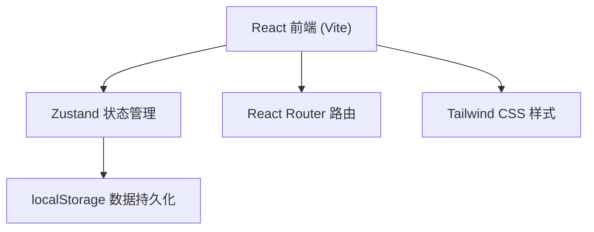

## 1. 架构设计



## 2. 技术说明

- **前端框架**：React@18 + TypeScript
- **构建工具**：Vite
- **路由**：react-router-dom
- **状态管理**：zustand
- **样式方案**：Tailwind CSS@3
- **图标库**：lucide-react
- **数据持久化**：localStorage（无后端，纯前端）
- **初始化方式**：vite-init react-ts 模板

## 3. 路由定义

| 路由 | 用途 |
|-------|---------|
| / | 首页：瀑布流展示所有电影卡片 |
| /movie/:id | 详情页：展示单部电影完整信息和评论 |
| /add | 录入页：添加新电影信息表单 |

## 4. 数据模型

### 4.1 类型定义

```typescript
interface Movie {
  id: string;
  title: string;
  posterUrl: string;
  genres: string[];
  rating: number; // 1-10
  shortReview: string;
  fullReview: string;
  director?: string;
  cast?: string;
  year?: number;
  runtime?: number; // 分钟
  createdAt: number;
}
```

### 4.2 数据存储

- 使用 zustand + localStorage middleware 持久化
- 初始注入若干 mock 电影数据便于展示
- 类型预设：动作、科幻、剧情、悬疑、爱情、动画、喜剧、恐怖、纪录片

## 5. 项目文件结构

```
src/
├── components/
│   ├── Header.tsx         # 顶栏（搜索+筛选+录入按钮）
│   ├── MovieCard.tsx      # 瀑布流卡片
│   ├── MovieGrid.tsx      # 瀑布流容器
│   ├── StarRating.tsx     # 星级评分展示
│   └── GenreTags.tsx      # 类型筛选标签
├── pages/
│   ├── HomePage.tsx       # 首页
│   ├── MovieDetailPage.tsx # 详情页
│   └── AddMoviePage.tsx   # 录入页
├── store/
│   └── useMovieStore.ts   # Zustand store
├── types/
│   └── index.ts           # 类型定义
├── data/
│   └── mockMovies.ts      # 初始 mock 数据
├── App.tsx
├── main.tsx
└── index.css
```
