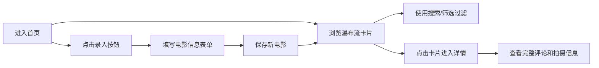

## 1. 产品概述

个人影评小站，用于记录和展示观影记录，深灰底配琥珀色高亮的深夜观影风格。支持瀑布流浏览、搜索筛选、详情查看及新片录入。

- 主要用途：个人观影记录管理与展示
- 目标用户：电影爱好者，个人使用
- 产品价值：打造沉浸式深夜观影氛围，方便回顾和整理观影体验

## 2. 核心功能

### 2.1 功能模块

1. **首页**：瀑布流电影卡片展示、顶栏搜索、类型筛选标签
2. **详情页**：完整评论、拍摄信息、海报大图
3. **录入页**：新电影信息表单录入

### 2.2 页面详情

| 页面名称 | 模块名称 | 功能描述 |
|-----------|-------------|---------------------|
| 首页 | 瀑布流卡片 | 展示海报缩略图、片名、评分、一句话短评 |
| 首页 | 顶栏搜索框 | 按片名关键词实时搜索过滤 |
| 首页 | 类型筛选标签 | 点击标签按类型过滤电影列表 |
| 详情页 | 电影信息区 | 大图海报、片名、评分、类型、拍摄信息 |
| 详情页 | 评论区 | 展示完整影评内容 |
| 录入页 | 信息表单 | 填写片名、海报链接、类型、评分、短评、完整评论 |
| 录入页 | 保存功能 | 提交后数据持久化并跳转首页 |

## 3. 核心流程

## 4. 用户界面设计

### 4.1 设计风格

- **主色调**：深灰色 (#1a1a1a / #262626) 背景
- **高亮色**：琥珀色 (#f59e0b / #d97706) 用于按钮、评分、链接悬停
- **文字色**：米白色 (#f5f5f4 / #e7e5e4) 主文字，稍暗灰 (#a8a29e) 辅助文字
- **按钮风格**：琥珀色填充圆角按钮，悬停时加深
- **卡片风格**：深灰卡片 + 微妙边框 + 悬停琥珀色描边
- **字体**：显示字体使用 Cinzel 或 Playfair Display 营造电影感；正文使用 Lora 或 Source Serif Pro
- **布局风格**：顶部导航栏 + CSS 瀑布流网格布局
- **图标风格**：Lucide 线性图标，琥珀色点缀

### 4.2 页面设计概览

| 页面名称 | 模块名称 | UI 元素 |
|-----------|-------------|-------------|
| 首页 | 顶部导航 | Logo（琥珀色）、搜索框、类型标签、录入按钮 |
| 首页 | 瀑布流卡片 | 海报图（圆角）、片名（米白）、星级评分（琥珀色）、短评（浅灰） |
| 详情页 | 顶部回退 | 返回按钮、电影标题 |
| 详情页 | 信息区 | 海报大图 + 右侧基本信息网格 |
| 详情页 | 评论区 | 段落排版、引用样式、琥珀色分隔线 |
| 录入页 | 表单 | 深色输入框、琥珀色聚焦边框、下拉选择、星级打分 |

### 4.3 响应式设计

- 桌面端：3-4 列瀑布流，详情页左右分栏
- 平板端：2 列瀑布流
- 移动端：单列瀑布流，详情页上下堆叠

### 4.4 动效设计

- 卡片悬停：轻微上浮 + 琥珀色发光描边
- 页面切换：淡入过渡
- 评分星星：琥珀色填充渐变
- 搜索输入：聚焦时边框琥珀色发光
